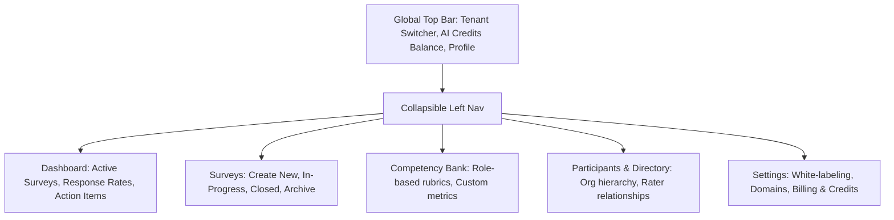

# NuVeda 360 Survey Platform
## Transforming a Fragmented LMS Module into a Scalable Standalone Enterprise AI Product

- **Role**: Lead Product Designer (Solo UX/UI)  
- **Company**: NuVeda Learning (Enterprise LMS & AI)  
- **Timeline**: First Handover Project (6 Weeks)  
- **Target Audience**: HR Leaders, Enterprise Talent Development Managers, People Ops  
- **Platform**: B2B Enterprise Web Application (Desktop-first)  
- **Key Impact**: Seamless Standalone IA, 3-Step White-Label Onboarding, AI Survey Generation + Credits Economy, 100% Production Handover to PM & Engineering

---

## ⚡ 30-Second Recruiter Summary

When I joined NuVeda Learning, leadership wanted to unbundle their internal 360-Degree Feedback feature from the core LMS and launch it as an independent B2B product: **NU 360**. An initial extraction by engineering had resulted in a disjointed, confusing interface with zero onboarding, no white-labeling capability, and tangled navigation.

**What I Did**:
1. **Screen-by-Screen Audit**: Audited every legacy screen to map dead ends, cognitive bottlenecks, and navigation failures.
2. **Information Architecture & Navigation**: Rebuilt the IA from the ground up, designing intuitive hierarchical dashboards and administrative paths.
3. **Enterprise Onboarding & White-Labeling**: Designed a 3-step setup (Workspace URL, Custom Branding/Colors, Admin Roles) enabling multi-tenant enterprise adoption.
4. **AI Survey Creator & Credit Economy**: Designed an AI-assisted survey generator that auto-creates 360 competency rubrics from prompts, supported by a transparent AI Credits purchase and validation system.
5. **Systematic PM/Dev Handover**: Delivered production-ready Figma design systems, interaction states, and user flows that unblocked immediate frontend implementation.

---

## 1. The Context & The Core Problem

### Context
NuVeda’s core product is CALF, an enterprise Learning Management System. Within CALF was a 360-degree feedback module used by HR teams to conduct multi-rater employee evaluations. Recognizing high market demand for specialized survey tools, leadership decided to spin it off into a **standalone commercial SaaS product**.

### The Problem: A Broken, Cluttered Extraction
Before I joined, an engineering-led attempt had carved the module out of the LMS, but it was not market-ready:
- **No Onboarding Flow**: New organizations were dropped into empty, overwhelming tables with zero guidance on how to launch their first survey.
- **Zero White-Labeling**: Enterprise clients could not customize logos, email templates, or domains—a dealbreaker for enterprise B2B sales.
- **Fragmented Navigation**: Because it was built inside an LMS context, the menus still assumed LMS workflows, resulting in deep, confusing click paths and lost context.
- **High Setup Friction**: Creating a 360 survey required manually entering dozens of competencies and questions, taking HR admins hours of tedious data entry.

```
[Legacy LMS Module] ──(Crude Extraction)──> [Cluttered Standalone UI]
                                                  ├── No Onboarding
                                                  ├── No White-Labeling
                                                  └── Manual 4-Hour Survey Setup
```

---

## 2. Discovery & The Screen-by-Screen Audit

Because this was my first project at NuVeda, I needed to thoroughly understand every technical constraint and user pain point.

### My Methodical Approach:
1. **Full Screen-by-Screen Audit**: Took high-resolution screenshots of every single existing screen and state.
2. **Journey Mapping**: Arranged screens sequentially in Figma to trace the admin's mental model versus the system's actual behavior.
3. **Friction Identification**:
   - **Information Hierarchy**: Critical actions (e.g., "Add Rater", "Assign Competency") were buried beneath tertiary settings.
   - **Visual Noise**: Tables were bloated with unformatted data columns and inconsistent spacing.
   - **Broken Feedback Loops**: Actions lacked success confirmations or loading states, causing users to double-click and submit duplicate forms.

---

## 3. Information Architecture & Navigation Redesign

To turn an extracted module into a legitimate standalone product, I restructured the global layout into a clean, predictable 3-tier hierarchy:



### Key UX Improvements:
- **Dedicated Global Context**: Admins always know which organization workspace and survey cycle they are currently viewing.
- **High-Velocity Action Paths**: Placed primary CTAs (*"Create New Survey"*, *"Invite Reviewers"*) in consistent top-right positions with keyboard shortcuts.

---

## 4. The 3-Step Enterprise Onboarding & White-Labeling Engine

For enterprise buyers, brand alignment and quick time-to-value are paramount. I designed an effortless onboarding wizard that transformed a previously non-existent process into a 3-minute setup:

### Step 1: Workspace URL & Tenant Identity
- Admin sets up custom workspace subdomain (e.g., `acme.nu360.com`).
- Live availability checker with instant validation.

### Step 2: Enterprise White-Labeling
- Upload company logo (light and dark mode variations).
- Live preview showing how the rater feedback portal looks with their custom brand color palette.
- Custom email domain signature for automated invitation emails.

### Step 3: Admin & Reviewer Roles Configuration
- Quick CSV upload or manual addition of HR administrators and survey managers with granular access controls.

---

## 5. The AI-Powered Survey Builder & Credits Economy

The biggest value leap in NU 360 was eliminating the 3–5 hours HR managers spent manually drafting competencies, rating scales, and open-ended questions.

### 5A. AI Survey Generator Interaction Design
Instead of starting from a blank page, admins can leverage the AI survey builder:
- **Input Drawer**: Admin selects the evaluation type (e.g., *"Executive Leadership 360"* or *"Engineering Manager Mid-Year Review"*) and inputs role focus areas.
- **Interactive Competency Generation**: The AI generates balanced competencies (e.g., Strategic Thinking, Empathy & Mentorship, Execution Speed) with measurable behavioral indicators.
- **Scannable Review & Inline Edit**: Admins can accept all, reject individual questions, or click to rephrase directly in place before finalizing.

### 5B. The AI Credits System UX
To support commercial SaaS monetisation and manage LLM operational costs, I designed the complete **AI Credits Economy**:
1. **Always-Visible Credit Status**: Persistent credit badge in the top navigation showing available tokens/credits.
2. **Pre-Flight Cost Validation**: Before generating a survey, the modal displays transparent cost preview:  
   *“Generating this 360 Competency Framework will use 5 AI Credits. Current Balance: 42 Credits.”*
3. **Friction-Free Top-Up Flow**: Integrated modal allowing admins to purchase credit packs (Starter, Growth, Enterprise) without leaving their active workflow.

### 5C. Designing the 5 AI UI States
To ensure the AI felt dependable rather than unpredictable, I designed 5 distinct UI states:
- **Cold Start**: Pre-loaded starter templates (*"Leadership 360"*, *"Peer Feedback"*, *"Manager Assessment"*).
- **Streaming State**: Progressive token rendering showing competencies emerging in real time with an animated progress bar.
- **High-Confidence Preview**: Clear diff cards showing generated questions with one-click `[Add to Survey]` or `[Regenerate]`.
- **Low-Confidence Warning**: Amber warning banner when admin input is too vague (*"Input 'manager' is broad. Select seniority level for more accurate competencies"*).
- **Failure / Fallback State**: Preserves all user inputs, avoids robotic error messages, and allows immediate one-click fallback to the standard manual competency bank.

---

## 6. Dashboard & Survey Lifecycle Management

A critical part of 360-degree feedback is tracking peer response completion without micromanagement:
- **Visual Pulse Dashboard**: Instant visual breakdown of survey participation:
  - Total participants invited.
  - Reviewer completion breakdown (Self-evaluations, Peer reviews, Manager reviews, Direct report reviews).
- **Automated Nudge Mechanics**: 1-click scheduled reminder emails to reviewers who have pending evaluations within 48 hours of deadline.

---

## 7. Design System, Specifications & PM Handover

As a solo designer handing over to the Product Manager and engineering team:
- **Design Tokens & Reusable Components**: Standardized buttons, modals, input fields, badges, and table rows in Figma, aligned with engineering's CSS framework.
- **Edge-Case Documentation**: Documented empty states, 404/500 errors, character overflow constraints, and mobile-responsive viewport behaviors.
- **Interactive Prototyping**: Created clickable high-fidelity prototypes demonstrating the entire journey from onboarding to survey launch, allowing the PM to validate user stories prior to sprint planning.

---

## 8. Business Impact & Senior Design Reflection

| Metric | Before Redesign | Post-Redesign (NU 360 Standalone) | Impact |
|---|---|---|---|
| **Survey Creation Time** | 3–4 Hours (Manual) | **12–15 Minutes (AI-Assisted)** | **~90% time saved** |
| **New Org Onboarding Time** | Undefined / Manual IT setup | **< 3 Minutes** | **Self-serve B2B onboarding** |
| **White-Label Readiness** | 0% (CALF LMS branding only) | **100% Multi-Tenant Customization** | **Enterprise sales unblocked** |
| **UX Consistency & Navigation** | Fragmented LMS sub-pages | **Clean 3-tier SaaS hierarchy** | **Production-ready handover** |

### Senior Design Learnings:
- **Unbundling is an Architecture Challenge, Not a Skinning Exercise**: You cannot simply pull a feature out of a parent platform and put a new logo on it. You must rethink navigation, user roles, billing, and onboarding from the ground up.
- **AI UX Requires Economic Transparency**: When designing AI features for B2B SaaS, the user experience must make costs and credits crystal clear so users feel in control of their spending.
- **Systems Rigor Builds Engineering Trust**: By auditing every legacy screen upfront and delivering explicit edge-case states, the handoff to the Product Manager and developers was frictionless and respected the team's build velocity.
